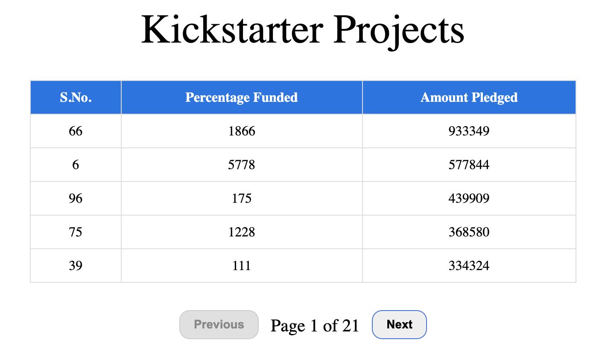
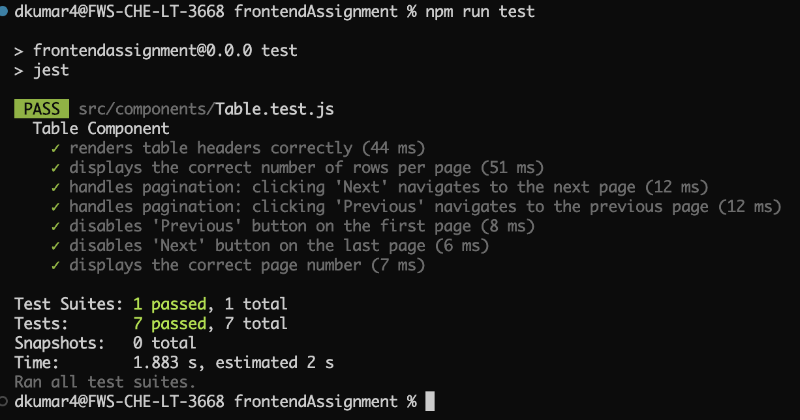

# Kickstarter Projects Table with Pagination

This project displays a list of highly-rated Kickstarter projects by fetching data from a provided API. The data is displayed in a responsive table format with the following attributes:

- **S.No.**: Serial number of the project.
- **Percentage funded**: The percentage of the funding goal achieved by the project.
- **Amount pledged**: The total amount pledged for the project.

## Features

- **AJAX Call**: Fetches data from the API `https://raw.githubusercontent.com/saaslabsco/frontend-assignment/refs/heads/master/frontend-assignment.json`.
- **Pagination**: Displays a maximum of 5 records per page, allowing users to navigate through the list of projects.
- **Aesthetic UI**: The table is designed with a clean and modern look, similar to ecommerce websites (like Amazon or Flipkart).
- **UX**: Ensures a smooth user experience, including proper handling of the last page in pagination.
- **Edge Case Handling**: The project ensures that edge cases (e.g., pagination on the last page) do not break the interface.
  
## Technologies Used

- **React Js**: For structuring the webpage.
- **CSS**: For styling and creating a responsive layout.
- **JavaScript (AJAX)**: For fetching and displaying the project data dynamically.
- **Jest**: For testing the application.

The table will automatically load the data from the API and paginate through the results with 5 records per page.

## Expected Output Format

## Unit Tests

- **Ensuring that core functionalities are tested** 
 
 

## License

This project is licensed under the MIT License - see the [LICENSE](LICENSE) file for details.

## Acknowledgements

- API data source: [Kickstarter Projects API](https://raw.githubusercontent.com/saaslabsco/frontend-assignment/refs/heads/master/frontend-assignment.json)

---

This README provides the necessary instructions, details, and a description of the project features.